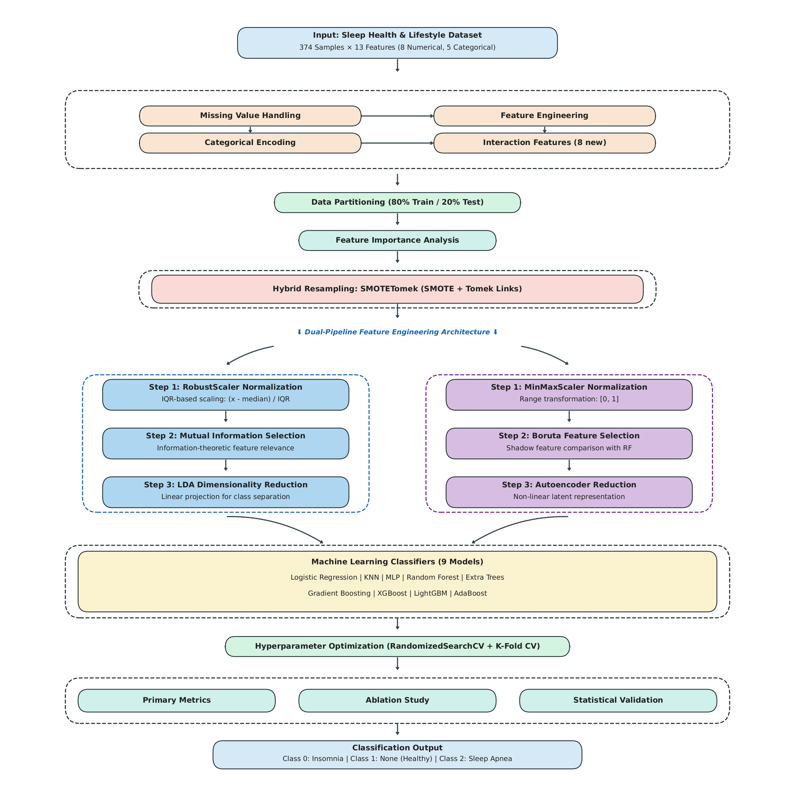

# 📄 Paper

---

## Title

**A Dual Pipeline Machine Learning Framework for Automated Multi-Class Sleep Disorder Screening Using Hybrid Resampling and Ensemble Learning**

- Preprint: [(arXiv)](https://arxiv.org/abs/2601.05814)

- Authors: **Md Sultanul Islam Ovi**, **Muhsina Tarannum Munfa**, **Miftahul Alam Adib**, **Syed Sabbir Hasan**


### Abstract

Accurate classification of sleep disorders, particularly insomnia and sleep apnea,
is vital for mitigating long term health risks and improving patient quality of life.
The traditional reliance on clinical sleep studies is resource intensive and lacks scalability for population level screening. This paper introduces a Dual Pipeline Machine
Learning Framework for analyzing and diagnosing multi class sleep disorders using
the Sleep Health and Lifestyle Dataset. We structured the methodology around two
parallel processing streams: a statistical pipeline focusing on linear separability via
Mutual Information and Linear Discriminant Analysis, and a wrapper based pipeline
leveraging Boruta selection and Autoencoders. To address severe class imbalance, we
utilized a hybrid SMOTETomek resampling strategy. Experimental results demonstrate that the Extra Trees and K Nearest Neighbors classifiers achieved a state of
the art accuracy of 98.67%, exceeding recent benchmarks. Furthermore, the Wilcoxon
Signed Rank Test confirmed statistically significant performance gains over baseline
models, with inference latencies maintained below 400 milliseconds. Thus, this research
proposes the Dual Pipeline Framework as a highly effective method, offering superior
classification performance and computational efficiency for automated, non invasive
risk stratification.

---

## Overview

### Dataset

**Sleep Health and Lifestyle Dataset** (Sourced from Kaggle) [(https://www.kaggle.com/datasets/uom190346a/sleep-health-and-lifestyle-dataset)]

- **Samples**: 374 clinical entries.
- **Target Classes**: `None` (219), `Sleep Apnea` (78), `Insomnia` (77).
- **Features**: 13 attributes including Sleep Duration, BMI, Blood Pressure, and physical activity levels.

### Methodology

<p align="center">
  
</p>


### Dual Pipeline Processing

##### Pipeline 1: Statistical

```python
# Scaling: RobustScaler (median/IQR normalization)
# Selection: Mutual Information (relevance filtering)
# Reduction: LDA (linear projection)
```

##### Pipeline 2: Wrapper-Based

```python
# Scaling: MinMaxScaler ([0,1] normalization)
# Selection: Boruta (shadow feature comparison)
# Reduction: Autoencoder (non-linear latent space)
```

#### Model Training & Validation

- **9 Classifiers**: Logistic Regression, K-Nearest Neighbors, Random Forest, XGBoost, Gradient Boosting, Extra Trees, AdaBoost, MLP Classifier, LightGBM
- **Hyperparameter Tuning**: RandomizedSearchCV
- **Cross-Validation**: Stratified 8-fold
- **Statistical Testing**: Wilcoxon Signed-Rank (p < 0.05)

### Results

#### Top Performing Models

##### Optimal performance metrics for Pipeline 1 utilizing statistical feature engineering and hybrid resampling strategies

| ML Model            | Configuration             | Accuracy | F1 Score | Recall  | Precision |
| :------------------ | :------------------------ | :------- | :------- | :------ | :-------- |
| Logistic Regression | RobustScaler + SMOTETomek | 96.000%  | 94.379%  | 94.798% | 94.737%   |
| K-Nearest Neighbors | MI + SMOTETomek           | 98.667%  | 97.850%  | 97.917% | 97.917%   |
| Random Forest       | LDA                       | 96.000%  | 93.521%  | 93.472% | 93.698%   |
| XGBoost Model       | MI + SMOTETomek           | 98.667%  | 97.850%  | 97.917% | 97.917%   |
| Gradient Boosting   | RobustScaler              | 96.000%  | 94.177%  | 93.611% | 94.815%   |
| Extra Trees         | RobustScaler              | 97.333%  | 95.658%  | 95.556% | 96.296%   |
| AdaBoost            | MI                        | 97.333%  | 95.694%  | 95.694% | 95.694%   |
| MLP Classifier      | MI                        | 96.000%  | 93.548%  | 93.611% | 93.611%   |
| LightGBM            | MI + SMOTETomek           | 98.667%  | 97.850%  | 97.917% | 97.917%   |

<br>

##### Optimal performance metrics for Pipeline 2 utilizing wrapper-based feature selection and non-linear dimensionality reduction

| ML Model            | Configuration             | Accuracy | F1 Score | Recall  | Precision |
| :------------------ | :------------------------ | :------- | :------- | :------ | :-------- |
| Logistic Regression | MinMaxScaler              | 97.333%  | 95.658%  | 95.556% | 96.296%   |
| K-Nearest Neighbors | Autoencoder               | 93.333%  | 92.324%  | 93.422% | 91.799%   |
| Random Forest       | MinMaxScaler + SMOTETomek | 97.333%  | 95.658%  | 95.556% | 96.296%   |
| XGBoost Model       | MinMaxScaler + SMOTETomek | 97.333%  | 95.694%  | 95.694% | 95.694%   |
| Gradient Boosting   | Boruta                    | 96.000%  | 93.521%  | 93.472% | 93.698%   |
| Extra Trees         | Boruta + SMOTETomek       | 98.667%  | 97.840%  | 97.778% | 98.039%   |
| AdaBoost            | Autoencoder               | 94.667%  | 93.780%  | 94.179% | 93.669%   |
| MLP Classifier      | Autoencoder + SMOTETomek  | 93.333%  | 91.676%  | 93.422% | 90.278%   |
| LightGBM            | MinMaxScaler              | 97.333%  | 95.694%  | 95.694% | 95.694%   |


### 📄 Citation

If you use this code or methodology in your research, please cite:

```bibtex
@article{ovi2026dual,
  title={A Dual Pipeline Machine Learning Framework for Automated Multi Class Sleep Disorder Screening Using Hybrid Resampling and Ensemble Learning},
  author={Ovi, Md Sultanul Islam and Munfa, Muhsina Tarannum and Adib, Miftahul Alam and Hasan, Syed Sabbir},
  year={2026}
}
```

#### 📝 License

This project is licensed under the MIT License

<p align="center">
  <strong>⭐ Star this repo if you find it useful! ⭐</strong>
</p>
